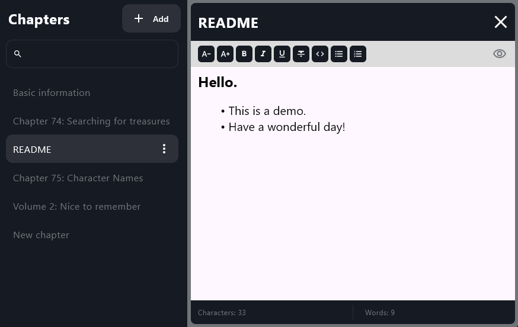
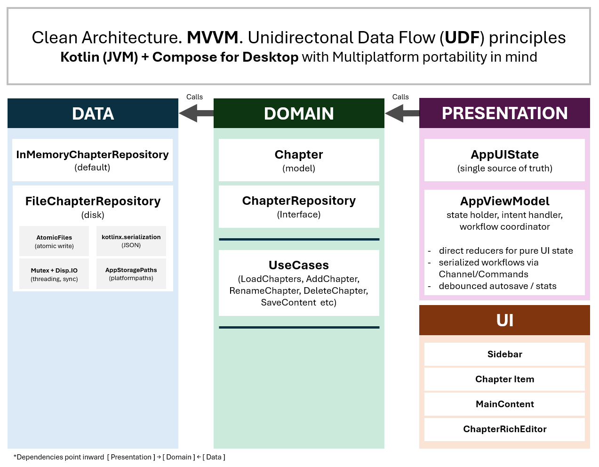

# Kotlin Multiplatform Desktop — Architecture Demo

## Overview
This is a Kotlin Multiplatform (KMP) desktop application built with Compose Multiplatform.

The purpose of this project is to demonstrate architecture rather than feature complexity.
The application is intentionally over-structured relative to its size.

The application is a chapter-based note editor supporting:

- Create chapter
- Rename chapter
- Delete chapter
- Load chapter content
- Edit and save content (with debouncing)
- HTML content normalization
- Persistent storage (JSON files, atomic writes)




---

## Architectural Principles

- **MVVM (Model–View–ViewModel)**
- **Single Source of Truth**
- **Unidirectional Data Flow (UDF) principles**
- **Layered architecture (Presentation / Domain / Data)**
- **UseCase isolation for business logic**
- **Repository abstraction**
- **Reactive state via StateFlow**
- **Sequential command processing inside ViewModel**

The project is intentionally structured to be scalable and testable.



---

## CI

A basic GitHub Actions pipeline is included to verify that the project builds on CI.

## Tests

Basic JUnit tests are included for domain UseCases (currently Add / Delete).

---

## Data & Persistence (Desktop)

Persistent storage is implemented via a file-based repository:

- **FileChapterRepository**
    - Stores chapters as `chapters/<uuid>.json`
    - Stores ordering separately in `index.json`
    - Uses a **Mutex** for thread-safety and `Dispatchers.IO`
    - Contains basic **self-healing**: for orphan files not referenced in `index.json` 
  

- **AtomicFiles**
    - Writes using a temp file + atomic move 

---


## Build & Run (Desktop JVM)

```bash
# macOS / Linux
./gradlew :composeApp:run

# Windows
.\gradlew.bat :composeApp:run
```

---


## Author
Made by Kyrylo (Kira) in Bergen for demo purposes and to make it easier to keep track of characters and events in the books I read!
